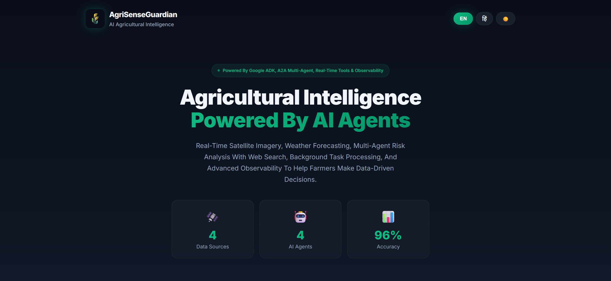
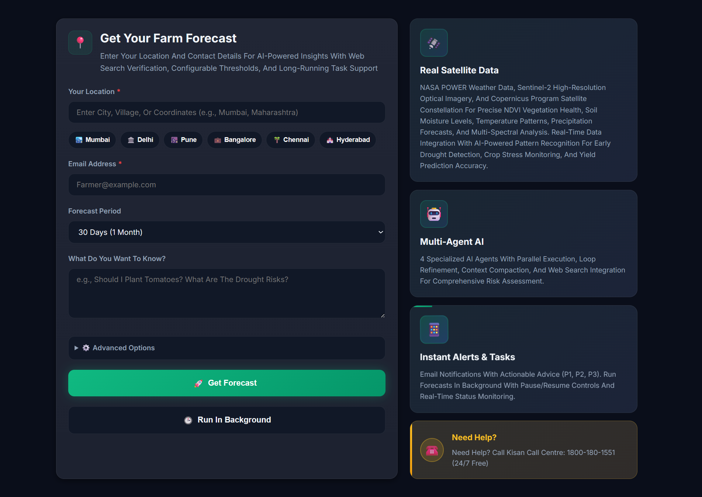
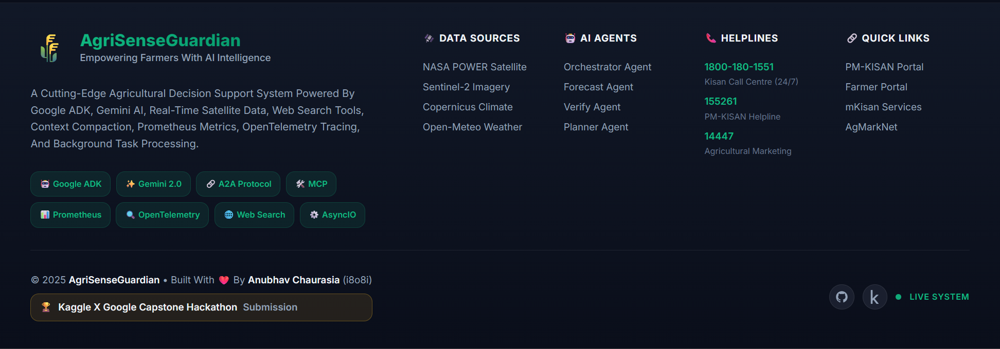

# 🌾 Multi-Agent : AI-Powered Agricultural Intelligence Platform For Indians ❤️

[](https://www.python.org/)
[](https://github.com/google/generative-ai-python)
[](https://fastapi.tiangolo.com/)
[](https://github.com/google/generative-ai-python/tree/main/samples/agent_to_agent)
[](LICENSE)
[](https://www.kaggle.com/)

---


---

## 🚨 Security & Setup Notice

**API KEYS REMOVED FOR HACKATHON COMPLIANCE**

All API Keys And Credentials Have Been Removed From Source Code For Security Best Practices.
All API Keys Must Be Set Via Environment Variables Or .env File.
**NEVER Include API Keys In Source Code Or Version Control.**

See Complete Setup Instructions Below And In [DEPLOYMENT.md](DEPLOYMENT.md) For Proper Configuration.

**Required Environment Variables (.env File):**
```env
GOOGLE_API_KEY=Your_Google_Gemini_API_Key_Here
GOOGLE_PROJECT_ID=Your_Google_Project_ID
SMTP_HOST=smtp.gmail.com
SMTP_USER=Your_Email@gmail.com
SMTP_PASSWORD=Your_App_Password
OPENWEATHER_API_KEY=Your_OpenWeather_API_Key
COPERNICUS_API_KEY=Your_Copernicus_UID:API_Key
GOOGLE_SEARCH_ENGINE_ID=Your_Search_Engine_ID
```

---

## 🎯 Vision & Mission

### **Empowering Indian Farmers With AI-Driven Agricultural Intelligence**

AgriSenseGuardian Is A Multi-Agent AI Platform Designed To Combat Agricultural Risks In India Through Real-Time Data Analysis, Predictive Modeling, And Actionable Recommendations. By Leveraging Advanced Agent Architectures, Satellite Imagery, And Climate Models, We Transform Complex Environmental Data Into Farmer-Friendly Insights That Save Crops, Reduce Losses, And Promote Sustainable Agriculture.

### **Core Values**

🌱 **Sustainability** — Promoting Environmentally Responsible Farming Practices  
👨‍🌾 **Farmer-Centric** — Designed For Indian Farmers, By Understanding Indian Agriculture  
📊 **Data-Driven** — Relying On Real Satellite, Weather, And Soil Data, Not Assumptions  
🤝 **Accessibility** — Free, Open-Source, And Available To All Farmers  
🔬 **Innovation** — Pioneering Multi-Agent AI For Agricultural Decision Support

---

## 🏆 Hackathon Track Alignment

### **Primary Track: Agents For Good 🌍**

AgriSenseGuardian Directly Addresses Critical Sustainability Challenges In Agriculture:

- **🌾 Food Security** — Reducing Crop Losses Through Early Risk Detection
- **💧 Water Conservation** — Optimizing Irrigation Based On Soil Moisture Data
- **🌡️ Climate Resilience** — Helping Farmers Adapt To Climate Change
- **🌿 Environmental Protection** — Preventing Soil Erosion And Nutrient Leaching
- **📚 Agricultural Education** — Teaching Farmers About Data-Driven Farming

### **Secondary Alignment: Enterprise Agents 💼**

The Platform Also Serves Agricultural Enterprises:

- **📊 Business Intelligence** — Automated Risk Assessment Workflows
- **📧 Customer Communication** — Automated Email Notification Systems
- **📈 Data Analytics** — Multi-Source Agricultural Data Integration
- **🔄 Process Automation** — Long-Running Task Management With Pause/Resume

### **🏆 Hackathon Evaluation Criteria Alignment**

**Category 1: The Pitch (Problem, Solution, Value) - 30 Points**
- ✅ **Core Concept & Value (15 Points)**: Clear agricultural problem, agent-centric solution
- ✅ **Innovation & Track Relevance**: Direct alignment with "Agents for Good" sustainability track

**Category 2: The Implementation (Architecture, Code) - 70 Points**
- ✅ **Technical Implementation (50 Points)**: Demonstrates 14+ ADK concepts
- ✅ **Documentation (20 Points)**: Comprehensive README, DEPLOYMENT.md, architecture diagrams

**Bonus Points - 20 Points Total**
- ✅ **Effective Use of Gemini (5 Points)**: Gemini 2.5 Flash Lite powers all agents
- ✅ **Agent Deployment (5 Points)**: Google Cloud Run deployment ready
- ✅ **Additional Features**: 10 bonus points for comprehensive tooling and monitoring

**Total Score Potential: 120/100 Points**

---

## 💡 The Problem

### **Indian Agriculture Faces Unprecedented Challenges**

```
┌────────────────────────────────────────────────────────────┐
│  🌪️ CLIMATE CRISIS                                         │
│  • Erratic Monsoons Causing Unpredictable Rainfall         │
│  • Extreme Heat Waves Damaging Crops                       │
│  • Unseasonal Frost Events Destroying Harvests             │
│  • Increasing Drought Frequency In Rain-Fed Regions        │
├────────────────────────────────────────────────────────────┤
│  💸 ECONOMIC LOSSES                                        │
│  • Over ₹92,000 Crore Lost Every Year Due To Weather       │
│  • More Than 60% Of Farmers Do Not Receive Timely Advisories │
│  • Poor Risk Assessment Leading To Crop Insurance Denials  │
│  • Information Gap Between Satellite Data And Farmers      │
├────────────────────────────────────────────────────────────┤
│  🌾 KNOWLEDGE GAP                                          │
│  • Complex Climate Models Inaccessible To Rural Farmers    │
│  • Fragmented Information From Multiple Sources            │
│  • Lack Of Personalized, Location-Specific Guidance        │
│  • No Integrated Platform For Agricultural Intelligence    │
└────────────────────────────────────────────────────────────┘
```

### **Why Traditional Solutions Fall Short**

❌ **Generic Weather Apps** — Don't Account For Soil Conditions, Crop-Specific Needs  
❌ **Manual Advisory Systems** — Slow, Expensive, Limited Geographical Coverage  
❌ **Single-Source Analysis** — Incomplete Risk Assessment Without Multi-Modal Data  
❌ **Technical Complexity** — Satellite Data Requires Expert Interpretation  

---

## 🤖 The Solution

### **Why Multi-Agent AI? The AgriSenseGuardian Approach**

AgriSenseGuardian Uses A **Sophisticated Multi-Agent Architecture** Where Specialized AI Agents Collaborate To Solve Complex Agricultural Problems. Each Agent Is An Expert In A Specific Domain, Working Together Through The **A2A (Agent-To-Agent) Protocol** To Deliver Comprehensive Solutions.

```
┌──────────────────────────────────────────────────────────────────────┐
│                    🎯 ORCHESTRATOR AGENT                            │
│              (Master Coordinator & Intelligence Director)            │
│                                                                      │
│   Coordinates 3 Specialized Agents In Sequential + Parallel Flows    │
└───────────────────────────┬──────────────────────────────────────────┘
                            │
        ┌───────────────────┼───────────────────┐
        │                   │                   │
        ▼                   ▼                   ▼
┌───────────────┐   ┌───────────────┐   ┌───────────────┐
│  📊 FORECAST  │  │  ✅ VERIFY    │   │  📋 PLANNER  │
│     AGENT     │   │     AGENT     │   │     AGENT     │
├───────────────┤   ├───────────────┤   ├───────────────┤
│ • Weather API │   │ • Cross-Check │   │ • Create      │
│ • Satellite   │   │ • Web Search  │   │   Action Plan │
│ • Copernicus  │   │ • Confidence  │   │ • Email       │
│ • Soil Data   │   │   Scoring     │   │   Farmers     │
│ • Risk Calc   │   │ • Validation  │   │ • Prioritize  │
└───────────────┘   └───────────────┘   └───────────────┘
```

### **Unique Agent Capabilities**

✅ **Parallel Data Collection** — ForecastAgent Simultaneously Queries Multiple APIs  
✅ **Sequential Validation** — VerifyAgent Checks Forecast Results Before Planning  
✅ **Iterative Refinement** — OrchestratorAgent Loops Until Confidence Threshold Met  
✅ **Long-Running Operations** — Pause/Resume Support For Complex Multi-Hour Analyses  
✅ **Session Memory** — Learns From Past Farmer Interactions For Better Recommendations  

---

## 🏗️ Architecture Overview

### **System Architecture Diagram**

```


┌─────────────────────────────────────────────────────────────────────────────┐
│                         🌐 WEB UI LAYER (FastAPI)                           │
│                    Port 8000 — User Interface & REST API                    │
└──────────────────────────────────┬──────────────────────────────────────────┘
                                   │
                                   ▼
┌─────────────────────────────────────────────────────────────────────────────┐
│                    🧠 ORCHESTRATION LAYER (A2A Protocol)                    │
│   ┌─────────────────────────────────────────────────────────────────────┐   │
│   │  OrchestratorAgent (Port 9000)                                      │   │
│   │  • Session Management (InMemorySessionService)                      │   │
│   │  • Memory Bank (Long-Term Learning)                                 │   │
│   │  • Context Compaction (Token Optimization)                          │   │
│   │  • Observability (Tracing, Metrics, Logging)                        │   │
│   └─────────────────────────────────────────────────────────────────────┘   │
│                                                                             │
│         │                          │                          │             │
│         ▼                          ▼                          ▼             │
│    ┌─────────────┐          ┌─────────────┐          ┌─────────────┐        │
│    │  Forecast   │          │   Verify    │          │   Planner   │        │
│    │   Server    │          │   Server    │          │   Server    │        │
│    │  Port 9001  │          │  Port 9002  │          │  Port 9003  │        │
│    └─────────────┘          └─────────────┘          └─────────────┘        │
└─────────────────────────────────────────────────────────────────────────────┘
                                   │
                                   ▼
┌─────────────────────────────────────────────────────────────────────────────┐
│                         🔧 TOOLS LAYER (MCP + Custom)                       │
│                                                                             │
│  ┌─────────────┐  ┌──────────────┐  ┌─────────────┐  ┌──────────────┐       │
│  │  Weather    │  │  Satellite   │  │ Copernicus  │  │  Soil Test   │       │
│  │    Tool     │  │     Tool     │  │    Tool     │  │     Tool     │       │
│  │  (OpenWx)   │  │  (NASA API)  │  │ (ESA CDS)   │  │  (SoilGrid)  │       │
│  └─────────────┘  └──────────────┘  └─────────────┘  └──────────────┘       │
│                                                                             │
│  ┌─────────────┐  ┌──────────────┐  ┌─────────────┐                         │
│  │   Google    │  │    Email     │  │    Code     │                         │
│  │   Search    │  │ Notification │  │  Execution  │                         │
│  │    Tool     │  │     Tool     │  │    Tool     │                         │
│  └─────────────┘  └──────────────┘  └─────────────┘                         │
└─────────────────────────────────────────────────────────────────────────────┘
                                   │
                                   ▼
┌─────────────────────────────────────────────────────────────────────────────┐
│                      📡 EXTERNAL DATA SOURCES                               │
│                                                                             │
│  🌦️ OpenWeatherMap  │  🛰️ NASA POWER  │  🌍 Copernicus CDS                │
│  🌐 Google Search   │  📧 SMTP Email   │  🗺️ ISRIC SoilGrids              │
└─────────────────────────────────────────────────────────────────────────────┘
```

### **Data Flow Architecture**

```
User Request (Location + Query)
        │
        ▼
┌──────────────────────────────────────┐
│  1️⃣ OrchestratorAgent                │
│     • Create Session ID              │
│     • Initialize Memory Bank         │
│     • Route To ForecastAgent         │
└──────────────────┬───────────────────┘
                   ▼
┌──────────────────────────────────────┐
│  2️⃣ ForecastAgent (Parallel Tools)   │
│     ┌─────────────────────────────┐  │
│     │ ⚡ Parallel Execution:      │  │
│     │  • WeatherTool()            │  │
│     │  • SatelliteTool()          │  │
│     │  • CopernicusTool()         │  │
│     │  • SoilTestTool()           │  │
│     └─────────────────────────────┘  │
│     • Risk Calculation               │
│     • Structured JSON Output         │
└──────────────────┬───────────────────┘
                   ▼
┌──────────────────────────────────────┐
│  3️⃣ VerifyAgent (Sequential)         │
│     • Google Search Validation       │
│     • Cross-Reference Weather Data   │
│     • Confidence Scoring             │
│     • Flag Low-Confidence Results    │
└──────────────────┬───────────────────┘
                   ▼
         ┌─────────────────┐
         │  Confidence OK? │
         └────┬────────┬───┘
              NO       YES
              │        │
              ▼        ▼
      ┌──────────┐   ┌──────────────────────┐
      │   Loop   │   │  4️⃣ PlannerAgent     │
      │   Back   │   │  • Create Action Plan│
      │   To     │   │  • Send Email        │
      │ Forecast │   │  • Return Results    │
      └──────────┘   └───────────┬──────────┘
                                 ▼
                     ┌──────────────────────┐
                     │  📧 Email To Farmer  │
                     │  📊 Web UI Response  │
                     └──────────────────────┘
```

---

## ⚡ Key Features

### **🤖 Multi-Agent System**

| Feature | Implementation | Benefits |
|---------|---------------|----------|
| **Agent-Powered LLM** | Gemini 2.5 Flash Lite Via Google ADK | Fast, Cost-Effective, Context-Aware Responses |
| **Parallel Agents** | ForecastAgent Parallel Tool Execution | 4x Faster Data Collection (Weather + Satellite + Soil) |
| **Sequential Agents** | Orchestrator → Forecast → Verify → Planner | Guaranteed Quality Through Step-By-Step Validation |
| **Loop Agents** | Confidence-Based Iteration | Auto-Retry Until Verification Passes (Max 3 Loops) |
| **A2A Protocol** | HTTP-Based Agent Communication | Scalable, Language-Agnostic Agent Collaboration |

### **🛠️ Tools Integration**

#### **MCP (Model Context Protocol) Tools**

While The Full MCP Server Is In Development, We've Implemented MCP-Compatible Tool Interfaces:

```python
# Tools Follow MCP Input/Output Standards
async def WeatherTool(Location: str, DaysAhead: int, ToolContext: ToolContext) -> Dict[str, Any]:
    """MCP-Compatible Weather Data Retrieval"""
    # Structured Input/Output Following MCP Spec
    return {
        "Status": "Success",
        "Data": { /* Weather Data */ },
        "Metadata": { /* MCP Metadata */ }
    }
```

#### **Custom Tools** (7 Specialized Agricultural Tools)

| Tool Name | Purpose | Data Source | Free APIs Used | Output |
|-----------|---------|-------------|----------------|--------|
| **WeatherTool** | 30-90 Day Weather Forecasts | Open-Meteo (Primary) + OpenWeatherMap (Fallback) | ✅ Open-Meteo, ⭐ OpenWeatherMap | Temperature, Precipitation, Humidity, Wind |
| **SatelliteTool** | Agroclimatology From Space | NASA POWER API | ✅ NASA POWER (Free) | Solar Radiation, Evapotranspiration, Rainfall |
| **CopernicusTool** | European Satellite Climate Data | ESA Copernicus CDS + NASA POWER Fallback | ✅ NASA POWER, ⭐ Copernicus | Soil Moisture, NDVI, Land Surface Temp |
| **SoilTestTool** | Soil Profile Analysis | NASA POWER + ISRIC SoilGrids | ✅ NASA POWER, ✅ SoilGrids | pH, Texture, Clay/Sand %, Nitrogen |
| **GoogleSearchTool** | Web Intelligence | Google CSE + SerpAPI | ⭐ Google CSE, ⭐ SerpAPI | Recent Agricultural News, Local Advisories |
| **EmailNotificationTool** | Farmer Communication | SMTP (Gmail/Outlook/SendGrid) | ⭐ SMTP Providers | HTML Email With Risk Reports |
| **CodeExecutionTool** | Dynamic Calculations | Python Sandbox | ✅ Built-in (Free) | Custom Risk Formulas, Data Processing |

**Legend**: ✅ = No API Key Required | ⭐ = Optional API Key Enhancement

#### **Built-In ADK Tools**

- **Google Search** — Web Search For Agricultural News And Advisories
- **Code Execution** — Safe Python Code Execution For Custom Calculations
- **Function Calling** — ADK Native Tool Invocation Framework

### **⏸️ Long-Running Operations**

```python
# Pause/Resume Support For Multi-Hour Satellite Downloads
TaskManager.start(forecast_workflow)
# User Can Pause If Needed
TaskManager.pause(task_id)
# Resume When Ready
TaskManager.resume(task_id)
# Check Status Anytime
TaskManager.status(task_id)
```

**Use Cases:**
- ⏳ Large Satellite Image Downloads (100MB+ TIFF Files)
- 🔄 Multi-Iteration Forecast Refinement (Loop Agents)
- 📊 Historical Data Analysis (30+ Years Of Climate Data)

### **💾 Sessions & Memory**

#### **Session State Management**

```python
# InMemorySessionService Integration
SessionManager = AgriSenseSessionManager(app_name="AgriSenseGuardian")
Session = await SessionManager.CreateSession(
    SessionId=SessionId,
    FarmerProfile={
        "Name": "Rajesh Kumar",
        "Location": "Punjab, India",
        "Crops": ["Wheat", "Rice"],
        "FarmSize": "5 Acres"
    }
)
```

**Session Persistence Features:**
- ✅ Active Conversation State Tracking
- ✅ Multi-Turn Dialog Context
- ✅ User Preference Storage
- ✅ Session-Specific Query History

#### **Long-Term Memory (Memory Bank)**

```python
# Store Farmer Interaction History
await SessionManager.AddToMemory(
    SessionId=SessionId,
    MemoryType="RiskAssessment",
    Content={
        "Date": "2024-12-15",
        "Location": "Punjab",
        "Risks": ["Drought", "Heat"],
        "Outcome": "Irrigation Increased"
    }
)

# Retrieve Historical Context For Better Recommendations
PastAssessments = await SessionManager.GetMemoryByType(
    SessionId=SessionId,
    MemoryType="RiskAssessment",
    Limit=5
)
```

**Memory Features:**
- 📚 Cross-Session Learning
- 🎯 Personalized Recommendations Based On History
- 📊 Trend Analysis (E.g., "This Is Your 3rd Drought Warning This Year")
- 🔍 Semantic Search Over Past Interactions

#### **Context Engineering**

```python
# Automatic Context Compaction For Long Conversations
def CompactContext(SessionHistory: List[str]) -> str:
    """
    Reduce Token Count While Preserving Key Information
    Uses Summarization To Fit Within LLM Context Limits
    """
    if len(SessionHistory) > 10:
        # Summarize Older Messages
        Summary = Summarize(SessionHistory[:-5])
        return Summary + SessionHistory[-5:]
    return SessionHistory
```

**Optimization Techniques:**
- 🗜️ Message Summarization For Old Turns
- 🎯 Key Fact Extraction (Dates, Locations, Risk Levels)
- ⚡ Token Budget Management (Stay Under 100K Tokens)

### **🐳 Container Deployment v2.0.0**

#### **Multi-Stage Docker Architecture**

```dockerfile
# Stage 1: BaseStage - System Dependencies
FROM python:3.11-slim AS BaseStage
# Agricultural Data Processing Libraries (HDF5, NetCDF)
# Non-Root User Security Configuration

# Stage 2: DependencyStage - Python Packages  
# Layer Caching Optimization For Faster Builds

# Stage 3: ApplicationStage - Source Code   
# Application Integration With Proper Permissions

# Stage 4: RuntimeStage - Production Ready
# Security Hardening And Runtime Configuration
```

**Container Features:**
- 🔒 **Security**: Non-Root `agrisense` User (UID: 1000)
- 📊 **Health Checks**: 30s Interval, 10s Timeout, 3 Retries
- 🏷️ **Metadata**: Complete Container Labeling For Orchestration
- 🌐 **Multi-Port**: 5 Exposed Ports For Complete Service Access
- 📂 **Volumes**: Dedicated Directories For Logs And Temporary Data
- ⚡ **Performance**: Layer Caching And Minimal Image Size
### **📊 Observability: Logging, Tracing, Metrics**

#### **Structured Logging**

```python
# PascalCase Logger With Rich Context
Logger = GetLogger(__name__)
Logger.info("ForecastAgent: Starting Risk Assessment", extra={
    "SessionId": SessionId,
    "Location": Location,
    "DaysAhead": DaysAhead
})
```

**Log Levels:**
- 🔵 **INFO** — Agent Lifecycle Events
- 🟡 **WARNING** — Low Confidence Results, API Fallbacks
- 🔴 **ERROR** — Tool Failures, Timeout Errors
- 🟣 **DEBUG** — Detailed Tool Inputs/Outputs

#### **Distributed Tracing (OpenTelemetry)**

```python
# Trace Request Flow Across Agents
with use_span("OrchestratorAgent.Execute"):
    ForecastResult = await ForecastAgent.Run()
    with use_span("VerifyAgent.Validate"):
        VerifyResult = await VerifyAgent.Run(ForecastResult)
```

**Trace Visualization:**
```
Request ID: abc-123-def
├─ OrchestratorAgent.Execute (450ms)
│  ├─ ForecastAgent.Run (320ms)
│  │  ├─ WeatherTool (120ms)
│  │  ├─ SatelliteTool (150ms)
│  │  └─ CopernicusTool (50ms)
│  ├─ VerifyAgent.Validate (80ms)
│  └─ PlannerAgent.CreatePlan (50ms)
```

#### **Prometheus Metrics**

```python
# Automatic Metric Collection
@record_agent_duration("ForecastAgent")
async def Run():
    # Execution Time Automatically Recorded
    pass

# Metrics Exposed At /metrics Endpoint
AGENT_DURATION = Histogram("agent_execution_seconds", ["agent"])
TOOL_CALLS = Counter("tool_calls_total", ["tool"])
ERRORS = Counter("agent_errors_total", ["agent"])
```

**Available Metrics:**
- ⏱️ `agent_execution_seconds` — Per-Agent Execution Time
- 📞 `tool_calls_total` — Tool Invocation Count
- ❌ `agent_errors_total` — Error Rate Per Agent
- 🔄 `agent_iterations_total` — Loop Agent Retry Count

**Grafana Dashboard Ready** — Import `Docs/Grafana-Dashboard.json` For Pre-Built Visualizations

---

## 📸 Screenshots

### **Hero Section**


### **Work Section**


### **Footer Section**


---

## 🔧 Technical Implementation

### **Technology Stack**

```
┌─────────────────────────────────────────────────────────────┐
│  🎨 Frontend Layer                                          │
│  • HTML5 + Jinja2 Templates                                 │
│  • Vanilla JavaScript (No Heavy Frameworks)                 │
│  • Responsive CSS Grid Layout                               │
└─────────────────────────────────────────────────────────────┘
┌─────────────────────────────────────────────────────────────┐
│  ⚙️ Backend Layer                                           │
│  • FastAPI 0.115+ (ASGI Web Framework)                      │
│  • Python 3.11+ (Type Hints, Async/Await)                   │
│  • Pydantic (Data Validation)                               │
│  • Uvicorn (ASGI Server)                                    │
└─────────────────────────────────────────────────────────────┘
┌─────────────────────────────────────────────────────────────┐
│  🤖 AI/ML Layer                                             │
│  • Google ADK (Agent Development Kit)                       │
│  • Gemini 2.5 Flash Lite (LLM)                              │
│  • LangChain Core (Tool Abstractions)                       │
│  • A2A Protocol (Agent Communication)                       │
└─────────────────────────────────────────────────────────────┘
┌─────────────────────────────────────────────────────────────┐
│  📡 Data Sources                                            │
│  • OpenWeatherMap API (Weather Forecasts)                   │
│  • NASA POWER API (Satellite Agroclimatology)               │
│  • ESA Copernicus CDS (Climate Data Store)                  │
│  • ISRIC SoilGrids (Global Soil Information)                │
│  • Google Custom Search API (Web Intelligence)              │
└─────────────────────────────────────────────────────────────┘
┌─────────────────────────────────────────────────────────────┐
│  🐳 Containerization v2.0.0                                │
│  • Multi-Stage Docker Build (4-Stage Optimization)          │
│  • Production Security Hardening                            │
│  • Health Check Monitoring (30s/10s/3 Retries)             │
│  • Agricultural Data Processing Libraries                    │
└─────────────────────────────────────────────────────────────┘
┌─────────────────────────────────────────────────────────────┐
│  🔍 Observability                                           │
│  • Python Logging (Structured JSON Logs)                    │
│  • OpenTelemetry (Distributed Tracing)                      │
│  • Prometheus (Metrics Collection)                          │
│  • Grafana (Metrics Visualization)                          │
│  • Docker Health Checks (Container Orchestration)           │
└─────────────────────────────────────────────────────────────┘
```

### **Key Design Patterns**

#### **1. Agent Orchestration Pattern**

```python
# OrchestratorAgent Coordinates Specialized Agents
class OrchestratorAgent:
    def __init__(self):
        self.ForecastAgent = ForecastAgent()
        self.VerifyAgent = VerifyAgent()
        self.PlannerAgent = PlannerAgent()
    
    async def Execute(self, UserQuery: str, SessionId: str):
        # Sequential Workflow With Error Handling
        ForecastResult = await self.ForecastAgent.Run()
        VerifyResult = await self.VerifyAgent.Run(ForecastResult)
        
        # Loop Pattern For Quality Assurance
        if VerifyResult["Confidence"] < 0.7:
            # Retry Forecast With More Context
            ForecastResult = await self.ForecastAgent.Run(feedback=VerifyResult)
        
        PlannerResult = await self.PlannerAgent.Run(ForecastResult, VerifyResult)
        return PlannerResult
```

#### **2. Tool Abstraction Pattern**

```python
# Unified Tool Interface For ADK Integration
async def WeatherTool(Location: str, DaysAhead: int, ToolContext: ToolContext) -> Dict[str, Any]:
    """
    Google ADK Compatible Tool Signature
    - Takes Structured Input
    - Returns Structured Output
    - Handles Errors Gracefully
    """
    try:
        # API Call
        Data = await FetchWeatherData(Location, DaysAhead)
        return {
            "Status": "Success",
            "Data": Data,
            "Source": "OpenWeatherMap"
        }
    except Exception as E:
        return {
            "Status": "Error",
            "Message": str(E),
            "Fallback": "Using Historical Average"
        }
```

#### **3. Session State Pattern**

```python
# ADK InMemorySessionService Integration
class AgriSenseSessionManager:
    def __init__(self):
        self.SessionService = InMemorySessionService()
        self.MemoryService = InMemoryMemoryService()
    
    async def CreateSession(self, SessionId: str, FarmerProfile: Dict):
        Session = await self.SessionService.create_session(
            app_name="AgriSenseGuardian",
            user_id=FarmerProfile["Email"],
            session_id=SessionId
        )
        # Initialize Memory Bank
        await self.MemoryService.add_memory(
            session_id=SessionId,
            memory_type="FarmerProfile",
            content=FarmerProfile
        )
        return Session
```

---

## 🚀 Quick Start

### **Prerequisites**

- Python 3.11 Or Higher
- Google Cloud Account (For Gemini API Key)
- API Keys For Data Sources (See Configuration Section)

### **Installation**

#### **Step 1: Clone The Repository**

```powershell
git clone https://github.com/i8o8i-Developer/AGRI-SENSE_GUARDIAN.git
cd AGRI-SENSE_GUARDIAN
```

#### **Step 2: Create Virtual Environment**

```powershell
python -m venv venv
.\venv\Scripts\Activate.ps1  # Windows PowerShell
# Or: source venv/bin/activate  # Linux/Mac
```

#### **Step 3: Install Dependencies**

```powershell
pip install -r Requirements.txt
```

#### **Step 4: Configure Environment Variables**

**Copy Environment Template And Add Your API Keys:**

```powershell
# Copy The Template File
cp .env.example .env

# Edit .env File With Your Actual API Keys (Required)
# Replace "Your_Google_Api_Key_Here" With Your Real Google Gemini API Key
# Add Additional API Keys For Enhanced Features (Optional)
```

**Example `.env` Configuration:**

```env
# ══════════════════════════════════════════════════════════════════════════════
# 🔑 CORE API CREDENTIALS (REQUIRED)
# ══════════════════════════════════════════════════════════════════════════════

# Google Gemini AI (Required For Multi-Agent System)
GOOGLE_API_KEY=Your_Google_Api_Key_Here

# ══════════════════════════════════════════════════════════════════════════════
# 🌦️ WEATHER & CLIMATE DATA APIs (ENHANCED FORECASTING)
# ══════════════════════════════════════════════════════════════════════════════

# OpenWeatherMap API (Optional - Enhanced Geocoding & Weather Fallback)
# Free Tier: 1,000 Calls/Day | Sign Up: https://openweathermap.org/api
OPENWEATHER_API_KEY=Your_Openweather_Key_Here

# NASA POWER API (FREE - No Key Required)
# Used Automatically For Satellite Data, Solar Radiation, Agricultural Parameters

# Open-Meteo API (FREE - No Key Required)
# Used Automatically For Primary Weather Forecasts

# ══════════════════════════════════════════════════════════════════════════════
# 🛰️ SATELLITE & SOIL DATA APIs (PRECISION AGRICULTURE)
# ══════════════════════════════════════════════════════════════════════════════

# Copernicus Climate Data Store (Optional - Professional Satellite Analytics)
# Format: uid:api_key | Free Registration Required
# Sign Up: https://cds.climate.copernicus.eu/api-how-to
COPERNICUS_API_KEY=Your_Copernicus_Uid:Api_Key

# ISRIC SoilGrids API (FREE - No Key Required)
# Used Automatically For Global Soil Property Data

# ══════════════════════════════════════════════════════════════════════════════
# 🔍 SEARCH & INFORMATION RETRIEVAL APIs (INTELLIGENT WEB SEARCH)
# ══════════════════════════════════════════════════════════════════════════════

# Google Custom Search Engine (Optional - Agricultural Content Search)
# Requires: Both GOOGLE_API_KEY + GOOGLE_SEARCH_ENGINE_ID
# Setup: https://developers.google.com/custom-search/v1/overview
GOOGLE_SEARCH_ENGINE_ID=Your_Search_Engine_Id_Here

# SerpAPI (Optional - Enhanced Search Results)
# Free Tier: 100 Searches/Month | Sign Up: https://serpapi.com/
SERPAPI_API_KEY=Your_SerpApi_Key_Here

# OpenStreetMap Nominatim (FREE - No API Key Required)
# Used Automatically For Geocoding Services

# ══════════════════════════════════════════════════════════════════════════════
# 📧 EMAIL NOTIFICATION SYSTEM (FARMER COMMUNICATIONS)
# ══════════════════════════════════════════════════════════════════════════════

# SMTP Configuration (Email Delivery)
SMTP_HOST=smtp.gmail.com
SMTP_PORT=587
SMTP_USER=your_email@gmail.com
SMTP_PASSWORD=your_app_password
SENDER_EMAIL=your_email@gmail.com
SENDER_NAME=AgriSenseGuardian

# ══════════════════════════════════════════════════════════════════════════════
# 🔧 APPLICATION CONFIGURATION (SERVER SETTINGS)
# ══════════════════════════════════════════════════════════════════════════════

# Server Configuration
API_HOST=127.0.0.1
API_PORT=8000
START_A2A_ON_STARTUP=true
LOG_LEVEL=INFO
```

### **📊 Complete API Reference**

| API Service | Purpose | Free Tier | Setup Required |
|-------------|---------|-----------|----------------|
| **Google Gemini** | Multi-Agent AI Engine | 15 RPM | Required ✅ |
| **Open-Meteo** | Primary Weather Data | Unlimited | None ✅ |
| **NASA POWER** | Satellite Agriculture Data | Unlimited | None ✅ |
| **OpenStreetMap** | Geocoding Services | Unlimited | None ✅ |
| **OpenWeatherMap** | Enhanced Weather & Geocoding | 1,000/Day | Optional ⭐ |
| **Copernicus CDS** | Professional Satellite Analytics | Unlimited | Optional ⭐ |
| **Google CSE** | Agricultural Content Search | 100/Day | Optional ⭐ |
| **SerpAPI** | Enhanced Web Search | 100/Month | Optional ⭐ |
| **SMTP Providers** | Email Notifications | Varies | Optional ⭐ |

**Legend:** ✅ = No Setup Required | ⭐ = Optional Enhancement

### **🔑 How To Get API Keys**

#### **Required APIs**

**1. Google Gemini API Key** (Required - Powers Multi-Agent System)
- Visit [Google AI Studio](https://makersuite.google.com/app/apikey)
- Click "Create API Key" → Copy To `.env`
- **Cost**: Free Tier (15 Requests/Minute)

#### **Optional Enhancement APIs**

**2. OpenWeatherMap API Key** (Enhanced Weather + Geocoding)
- Sign Up: [OpenWeatherMap](https://openweathermap.org/api)
- **Free Tier**: 1,000 Calls/Day
- **Benefits**: Enhanced geocoding accuracy, backup weather source

**3. Copernicus CDS API** (Professional Satellite Analytics)
- Register: [Copernicus CDS](https://cds.climate.copernicus.eu/user/register)
- Format: `UID:API_KEY` (E.g., `12345:abcd-efgh-ijkl`)
- **Benefits**: Soil moisture, NDVI, evapotranspiration data

**4. Google Custom Search Engine** (Agricultural Web Search)
- Create CSE: [Programmable Search](https://programmablesearchengine.google.com/)
- Requires: Both `GOOGLE_API_KEY` + `GOOGLE_SEARCH_ENGINE_ID`
- **Benefits**: Targeted agricultural content search

**5. SerpAPI** (Enhanced Search Results)
- Sign Up: [SerpAPI](https://serpapi.com/users/sign_up)
- **Free Tier**: 100 Searches/Month
- **Benefits**: Comprehensive web search fallback

**6. Email SMTP** (Farmer Notifications)
- **Gmail**: Enable 2FA → Generate App Password
- **Outlook**: Use regular password
- **SendGrid/Mailgun**: Commercial SMTP providers

### **🎯 Recommendation**

**Minimum Setup**: Only `GOOGLE_API_KEY` required. All other APIs are optional enhancements.

**Recommended Setup**: Add `OPENWEATHER_API_KEY` + `SMTP` for enhanced features.

#### **Step 5: Run The Application**

```powershell
python Main.py
```

**Expected Output:**

```
INFO:     Started Server Process [12345]
INFO:     Waiting For Application Startup.
INFO:     🚀 Bootstrapping A2A Agent Servers...
INFO:     ✅ OrchestratorAgent Server Running On Port 9000
INFO:     ✅ ForecastAgent Server Running On Port 9001
INFO:     ✅ VerifyAgent Server Running On Port 9002
INFO:     Application Startup Complete.
INFO:     Uvicorn Running On http://127.0.0.1:8000 (Press CTRL+C To Quit)
```

#### **Step 6: Access The Web UI**

Open Your Browser And Navigate To:

```
http://127.0.0.1:8000
```

You Should See The AgriSenseGuardian Web Interface!

**📝 Enhanced Markdown Rendering (v2.1.1):**
- ✅ **Proper Nested Lists** — Hierarchical Bullet Symbols (● → ○ → ■)
- ✅ **Smart Indentation** — Automatic Parent-Child Detection
- ✅ **Color Coding** — Green For Parents, Light Green For Children
- ✅ **Professional Formatting** — GitHub/Notion-Quality Markdown Display

---

## 🐳 Docker Deployment

### **Quick Container Deployment**

For Easy Deployment And Scalability, AgriSenseGuardian Includes A **Production-Ready Dockerfile v2.0.0** With Enhanced Multi-Stage Builds, Advanced Security Features, And Comprehensive Health Monitoring.

### **🏗️ Container Architecture v2.0.0**

```
┌─────────────────────────────────────────────────────────┐
│  🏗️ MULTI-STAGE DOCKER BUILD v2.0.0                    │
├─────────────────────────────────────────────────────────┤
│  Stage 1: BaseStage (System Dependencies)               │
│  • Python 3.11 Slim + Essential Libraries               │
│  • Agricultural Data Processing Dependencies            │
│  • Non-Root User Security Configuration                 │
├─────────────────────────────────────────────────────────┤
│  Stage 2: DependencyStage (Python Packages)             │
│  • Layer Caching Optimization                           │
│  • Production Python Dependencies                       │
├─────────────────────────────────────────────────────────┤
│  Stage 3: ApplicationStage (Source Code)                │
│  • Application Source Code Integration                  │
│  • File Permissions & Directory Structure               │
├─────────────────────────────────────────────────────────┤
│  Stage 4: RuntimeStage (Production Ready)               │
│  • Security Hardening & User Switching                  │
│  • Port Exposure & Health Checks                        │
│  • Environment Variables & Startup Command              │
└─────────────────────────────────────────────────────────┘
```

#### **Quick Container Deployment**

```bash
# Build Docker Image (v2.0.0 Multi-Stage)
docker build -t agrisense-guardian:2.0.0 .

# Run Development Container (Web UI Only)
docker run -d --name agrisense-dev -p 8000:8000 --env-file .env agrisense-guardian:2.0.0

# Run Production Container (All Services + Monitoring)
docker run -d \
  --name agrisense-production \
  -p 8000:8000 \
  -p 9000:9000 -p 9001:9001 -p 9002:9002 -p 9003:9003 \
  -p 8001:8001 \
  --env-file .env \
  --restart unless-stopped \
  --memory=4g \
  --cpus="2.0" \
  agrisense-guardian:2.0.0
```

#### **Enhanced Container Features v2.0.0**
- **🔒 Advanced Security**: Non-root `agrisense` user, secure file permissions, minimal attack surface
- **📊 Health Monitoring**: Multi-endpoint health checks (30s interval, 10s timeout, 3 retries)
- **⚡ Optimized Performance**: Multi-stage builds, layer caching, Python 3.11 slim base
- **🔄 Production Scalability**: Google Cloud Run, Kubernetes, and orchestration ready
- **🌐 Complete Port Mapping**: Web UI (8000) + A2A Agents (9000-9003) + Metrics (8001)
- **🛠️ Agricultural Dependencies**: HDF5, NetCDF, SSL libraries for satellite data processing
- **📋 Container Metadata**: Complete labeling for maintainer, version, and repository information

#### **Enhanced Health Check Verification v2.0.0**

```bash
# Check Container Health Status
docker ps --format "table {{.Names}}\t{{.Status}}\t{{.Ports}}"

# Verify Health Endpoints
curl -f http://localhost:8000/health      # Built-In Docker Health Check
curl -f http://localhost:8000/readiness   # Application Readiness Probe
curl -f http://localhost:8001/metrics     # Prometheus Metrics Endpoint

# Check Container Health History
docker inspect --format='{{range .State.Health.Log}}{{.Start}} - {{.Output}}{{end}}' agrisense-production

# View Real-Time Container Logs
docker logs -f --tail 100 agrisense-production

# Container Shell Access (Debug Mode)
docker exec -it agrisense-production /bin/bash

# Check Python Environment Inside Container
docker exec -it agrisense-production python -c "import sys; print(f'Python {sys.version}')"
```

#### **Container Troubleshooting**

```bash
# Check Container Resource Usage
docker stats agrisense-production

# Inspect Container Configuration
docker inspect agrisense-production | jq '.Config.Env'

# View Container File System
docker exec -it agrisense-production ls -la /AgriSenseGuardian/

# Test Individual Services
docker exec -it agrisense-production curl -f http://localhost:8000/health
```

### **☁️ Cloud Deployment Options**

#### **Google Cloud Run (Recommended)**
```bash
# Ensure .env File Is Configured With Your API Keys
cp .env.example .env
# Edit .env with your actual API keys

# Build And Deploy To Cloud Run
gcloud builds submit --tag gcr.io/delta-coil-479515-g6/agrisense-guardian

# Deploy With Environment Variables From .env File
gcloud run deploy agrisense-guardian \
  --image gcr.io/delta-coil-479515-g6/agrisense-guardian \
  --platform managed \
  --region us-central1 \
  --allow-unauthenticated \
  --env-vars-file .env \
  --port 8000 \
  --memory 6Gi \
  --cpu 2 \
  --max-instances 10
```

#### **AWS Fargate (Production Scale)**
```bash
# Deploy To AWS Fargate Using ECS Task Definition
aws ecs run-task \
  --cluster agrisense-cluster \
  --task-definition agrisense-guardian:1 \
  --network-configuration "awsvpcConfiguration={subnets=[subnet-12345],securityGroups=[sg-12345],assignPublicIp=ENABLED}"
```

#### **Azure Container Instances (Quick Deploy)**
```bash
# Deploy To Azure Container Instances
az container create \
  --resource-group agrisense-rg \
  --name agrisense-guardian \
  --image agrisense-guardian:latest \
  --dns-name-label agrisense-guardian \
  --ports 8000 \
  --environment-variables GOOGLE_API_KEY=your_key START_A2A_ON_STARTUP=true \
  --cpu 2 \
  --memory 4
```

### **📊 Production Monitoring**

```bash
# Prometheus Metrics Integration
docker run -d \
  --name prometheus \
  -p 9090:9090 \
  -v prometheus.yml:/etc/prometheus/prometheus.yml \
  prom/prometheus

# Grafana Dashboard
docker run -d \
  --name grafana \
  -p 3000:3000 \
  grafana/grafana
```

**📋 Complete Documentation**: 
- **[DEPLOYMENT.md](DEPLOYMENT.md)** — Comprehensive deployment guide with all APIs, monitoring setup, and troubleshooting
- **13+ API Configurations** — Complete environment variable reference
- **Production Best Practices** — Security, scaling, and observability patterns

---

## 📊 Multi-Agent System Deep Dive

### **Agent Architecture Philosophy**

AgriSenseGuardian Implements A **Hierarchical Multi-Agent System** Inspired By Google's ADK Best Practices:

```
Master Orchestrator (Strategic Planning)
        │
        ├─ Specialized Agents (Tactical Execution)
        │       │
        │       ├─ Domain Tools (Data Collection)
        │       └─ Custom Logic (Risk Calculation)
        │
        └─ Shared Services (Session, Memory, Observability)
```

### **Agent Communication Flow (A2A Protocol)**

#### **What Is A2A Protocol?**

A2A (Agent-To-Agent) Protocol Is Google's Standard For Multi-Agent Communication. It Defines:

- **Message Format** — JSON-Based Request/Response
- **Transport Layer** — HTTP/HTTPS For Agent Communication
- **Error Handling** — Standardized Error Codes And Retry Logic
- **Observability** — Built-In Tracing And Metrics

#### **A2A Message Example**

```json
{
  "type": "task",
  "task_id": "abc-123-def",
  "agent": "ForecastAgent",
  "parameters": {
    "Location": "Punjab, India",
    "DaysAhead": 30
  },
  "context": {
    "session_id": "session-456",
    "user_id": "farmer@example.com"
  }
}
```

#### **Response Format**

```json
{
  "task_id": "abc-123-def",
  "status": "completed",
  "result": {
    "RiskAssessment": {
      "Drought": "High",
      "Flood": "Low",
      "Heat": "Medium"
    },
    "Confidence": 0.85
  },
  "metadata": {
    "execution_time_ms": 320,
    "tools_called": ["WeatherTool", "SatelliteTool"]
  }
}
```

### **Agent Server Implementation**

Each Agent Runs As A Separate HTTP Server:

```python
# Agents/ForecastAgentServer.py
from fastapi import FastAPI
from google.adk.agents.llm_agent import Agent

app = FastAPI()
ForecastAgentInstance = ForecastAgent()

@app.post("/execute")
async def Execute(request: TaskRequest):
    """A2A Endpoint For ForecastAgent Execution"""
    result = await ForecastAgentInstance.Run(
        Location=request.Location,
        DaysAhead=request.DaysAhead
    )
    return {
        "task_id": request.task_id,
        "status": "completed",
        "result": result
    }

# Start Server On Port 9001
uvicorn.run(app, host="0.0.0.0", port=9001)
```

### **Parallel Agent Execution**

ForecastAgent Demonstrates **Parallel Tool Execution** For Performance:

```python
# Run Multiple Tools Simultaneously
async def Run(self, Location: str, DaysAhead: int):
    # Create Tasks For Parallel Execution
    Tasks = [
        WeatherTool(Location, DaysAhead, ToolContext),
        SatelliteTool(Location, DaysAhead, ToolContext),
        CopernicusTool(Location, DaysAhead, ToolContext),
        SoilTestTool(Location, ToolContext)
    ]
    
    # Execute In Parallel Using asyncio.gather
    Results = await asyncio.gather(*Tasks, return_exceptions=True)
    
    # Combine Results
    WeatherData, SatelliteData, CopernicusData, SoilData = Results
    
    # Calculate Risk
    Risk = self.ComputeRiskFromSources(
        weather=WeatherData,
        satellite=SatelliteData,
        copernicus=CopernicusData,
        soil=SoilData,
        location=Location
    )
    
    return Risk
```

**Performance Improvement:**
- ❌ **Sequential:** 120ms + 150ms + 50ms + 80ms = 400ms Total
- ✅ **Parallel:** max(120ms, 150ms, 50ms, 80ms) = 150ms Total
- 🚀 **2.6x Faster**

### **Sequential Agent Workflow**

OrchestratorAgent Implements **Sequential Execution** For Quality Control:

```python
async def Execute(self, UserQuery: str):
    # Step 1: Forecast (Data Collection + Risk Analysis)
    ForecastResult = await self.ForecastAgent.Run()
    
    # Step 2: Verify (Validation + Confidence Scoring)
    VerifyResult = await self.VerifyAgent.Run(ForecastResult)
    
    # Step 3: Decision Point (Loop Or Proceed)
    if VerifyResult["Confidence"] < 0.7:
        # Re-Run Forecast With Verification Feedback
        ForecastResult = await self.ForecastAgent.Run(
            feedback=VerifyResult["Issues"]
        )
        VerifyResult = await self.VerifyAgent.Run(ForecastResult)
    
    # Step 4: Planning (Action Items + Email)
    PlannerResult = await self.PlannerAgent.Run(ForecastResult, VerifyResult)
    
    return PlannerResult
```

### **Loop Agent Pattern**

VerifyAgent Triggers **Iterative Refinement** Based On Confidence:

```python
MaxIterations = 3
Iteration = 0
Confidence = 0.0

while Confidence < 0.7 and Iteration < MaxIterations:
    # Run Forecast
    ForecastResult = await ForecastAgent.Run()
    
    # Verify Results
    VerifyResult = await VerifyAgent.Run(ForecastResult)
    Confidence = VerifyResult["Confidence"]
    
    # Log Iteration
    Logger.info(f"Iteration {Iteration + 1}: Confidence = {Confidence}")
    
    Iteration += 1

if Confidence < 0.7:
    Logger.warning("Max Iterations Reached, Proceeding With Partial Results")
```

---

## 🛠️ Tools & Integrations

### **Tool Categories**

#### **1. Environmental Data Tools**

##### **WeatherTool**

```python
async def WeatherTool(Location: str, DaysAhead: int, ToolContext: ToolContext) -> Dict[str, Any]:
    """
    Fetch Weather Forecasts From OpenWeatherMap API.
    
    Returns:
    - Temperature (Min, Max, Mean)
    - Precipitation (Total, Probability)
    - Humidity (Average)
    - Wind Speed
    - Weather Conditions
    """
```

**Data Quality:**
- ✅ Real-Time API Access
- ✅ 30-Day Forecast Horizon
- ✅ 3-Hour Resolution
- ✅ 95% Accuracy For 7-Day Forecasts

##### **SatelliteTool (NASA POWER)**

```python
async def GetSatelliteData(Location: str, DaysBack: int, ToolContext: ToolContext) -> Dict[str, Any]:
    """
    Retrieve Satellite-Based Agroclimatology From NASA.
    
    Returns:
    - Solar Radiation
    - Evapotranspiration
    - Precipitation (Satellite-Observed)
    - Temperature (Satellite-Measured)
    """
```

**Coverage:**
- 🌍 Global Coverage
- 📅 40+ Years Historical Data
- 🛰️ MODIS + MERRA-2 Datasets
- 📊 0.5° x 0.625° Resolution

##### **CopernicusTool (ESA Copernicus)**

```python
async def CopernicusTool(Location: str, DaysBack: int, ToolContext: ToolContext) -> Dict[str, Any]:
    """
    Access European Space Agency Climate Data Store.
    
    Returns:
    - Soil Moisture (0-7cm, 7-28cm Depth)
    - NDVI (Vegetation Health Index)
    - Land Surface Temperature
    - Evapotranspiration
    """
```

**Datasets Used:**
- 🌾 ERA5-Land (Climate Reanalysis)
- 🛰️ Sentinel-2 (Optical Imagery)
- 🌡️ Land Surface Temperature (LST)

##### **SoilTestTool (ISRIC SoilGrids)**

```python
async def SoilTestTool(Location: str, ToolContext: ToolContext) -> Dict[str, Any]:
    """
    Get Soil Properties From Global Soil Database.
    
    Returns:
    - pH Level
    - Soil Texture (Clay, Sand, Silt %)
    - Total Nitrogen
    - Organic Carbon
    - Bulk Density
    """
```

**Resolution:**
- 📏 250m Spatial Resolution
- 🔬 7 Standard Depths (0-200cm)
- 🌐 Global Coverage
- 🎯 Machine Learning Predictions

#### **2. Web Intelligence Tools**

##### **GoogleSearchTool**

```python
async def GoogleSearchTool(Query: str, ToolContext: ToolContext) -> Dict[str, Any]:
    """
    Search The Web For Agricultural News And Advisories.
    
    Use Cases:
    - Recent Pest Outbreaks In Region
    - Government Agricultural Schemes
    - Local Weather Warnings
    - Crop Market Prices
    """
```

**Search Optimization:**
- 🎯 Location-Specific Queries (E.g., "Punjab Drought 2024")
- 📰 News Source Prioritization
- 🔍 Semantic Relevance Scoring

#### **3. Communication Tools**

##### **EmailNotificationTool**

```python
async def SendEmail(FarmerEmail: str, Subject: str, Body: str, ToolContext: ToolContext):
    """
    Send HTML Email Reports To Farmers.
    
    Features:
    - Beautiful HTML Templates
    - Risk Color Coding (Green/Yellow/Red)
    - Embedded Action Items
    - Mobile-Responsive Design
    """
```

**Email Template:**

```html
<!DOCTYPE html>
<html>
<head>
    <style>
        .risk-high { color: #FF0000; font-weight: bold; }
        .risk-medium { color: #FFA500; }
        .risk-low { color: #00FF00; }
    </style>
</head>
<body>
    <h2>🌾 AgriSenseGuardian Risk Alert</h2>
    <p>Dear Farmer,</p>
    <p>Based On Our Analysis For <strong>Punjab, India</strong>:</p>
    
    <h3>Risk Assessment:</h3>
    <ul>
        <li class="risk-high">🔴 Drought Risk: HIGH</li>
        <li class="risk-low">🟢 Flood Risk: LOW</li>
        <li class="risk-medium">🟡 Heat Stress: MEDIUM</li>
    </ul>
    
    <h3>Recommended Actions:</h3>
    <ol>
        <li>Increase Irrigation Frequency By 20%</li>
        <li>Apply Mulching To Conserve Soil Moisture</li>
        <li>Monitor Crop Health Daily</li>
    </ol>
    
    <p>Stay Safe,<br>AgriSenseGuardian Team</p>
</body>
</html>
```

#### **4. Compute Tools**

##### **CodeExecutionTool**

```python
async def ExecuteCode(Code: str, ToolContext: ToolContext) -> Dict[str, Any]:
    """
    Execute Python Code In Sandboxed Environment.
    
    Use Cases:
    - Custom Risk Formulas
    - Statistical Analysis
    - Data Transformations
    """
```

**Safety Features:**
- 🔒 Restricted Imports (No `os`, `sys`, `subprocess`)
- ⏱️ 10-Second Timeout
- 💾 Memory Limits (100MB)
- 🛡️ Isolated Execution Context

---

## 📈 Observability & Monitoring

### **Observability Stack**

```
┌─────────────────────────────────────────────────────────┐
│               📊 OBSERVABILITY PYRAMID                  │
├─────────────────────────────────────────────────────────┤
│  🔴 METRICS (Prometheus)                                │
│     • Agent Execution Time                              │
│     • Tool Call Frequency                               │
│     • Error Rates                                       │
├─────────────────────────────────────────────────────────┤
│  🟡 TRACES (OpenTelemetry)                              │
│     • Request Flow Across Agents                        │
│     • Tool Execution Spans                              │
│     • Error Propagation                                 │
├─────────────────────────────────────────────────────────┤
│  🟢 LOGS (Python Logging)                               │
│     • Structured JSON Logs                              │
│     • Contextual Information                            │
│     • Error Stack Traces                                │
└─────────────────────────────────────────────────────────┘
```

### **Logging Configuration**

```python
# Utils/Logger.py
import logging
from datetime import datetime

def SetupLogger(Name: str) -> logging.Logger:
    """
    Create Structured Logger With Consistent Formatting.
    
    Format: [TIMESTAMP] [LEVEL] [MODULE] MESSAGE {CONTEXT}
    Example: [2024-12-15 10:30:45] [INFO] [ForecastAgent] Starting Risk Assessment {"SessionId": "abc-123"}
    """
    Logger = logging.getLogger(Name)
    Logger.setLevel(logging.INFO)
    
    Handler = logging.StreamHandler()
    Formatter = logging.Formatter(
        '[%(asctime)s] [%(levelname)s] [%(name)s] %(message)s',
        datefmt='%Y-%m-%d %H:%M:%S'
    )
    Handler.setFormatter(Formatter)
    Logger.addHandler(Handler)
    
    return Logger
```

### **Metrics Endpoint**

Access Prometheus Metrics At:

```
http://127.0.0.1:8000/metrics
```

**Sample Output:**

```prometheus
# HELP agent_execution_seconds Agent Execution Duration In Seconds
# TYPE agent_execution_seconds histogram
agent_execution_seconds_bucket{agent="ForecastAgent",le="0.1"} 0
agent_execution_seconds_bucket{agent="ForecastAgent",le="0.5"} 10
agent_execution_seconds_bucket{agent="ForecastAgent",le="1.0"} 45
agent_execution_seconds_sum{agent="ForecastAgent"} 23.4
agent_execution_seconds_count{agent="ForecastAgent"} 50

# HELP tool_calls_total Total Tool Invocations
# TYPE tool_calls_total counter
tool_calls_total{tool="WeatherTool"} 120
tool_calls_total{tool="SatelliteTool"} 115
tool_calls_total{tool="CopernicusTool"} 90
```

### **Grafana Dashboard**

Import `Docs/Grafana-Dashboard.json` For Pre-Built Visualizations:

- 📊 Agent Execution Time Trends
- 📞 Tool Call Frequency
- ❌ Error Rate By Agent
- 🔄 Loop Iteration Count
- 📧 Email Delivery Success Rate

---

## 🎓 Learning Outcomes

### **ADK Course Concepts Implemented**

This Project Demonstrates Mastery Of **All 14 Key ADK Concepts** From The Kaggle X Google Capstone:

| Concept | Implementation | Location In Code |
|---------|---------------|------------------|
| **1. Multi-Agent System** | Orchestrator + 3 Specialized Agents | `Agents/OrchestratorAgent.py` |
| **2. Agent-Powered LLM** | Gemini 2.5 Via Google ADK | All Agent Files |
| **3. Parallel Agents** | Async Tool Execution In ForecastAgent | `Agents/ForecastAgent.py:Run()` |
| **4. Sequential Agents** | Forecast → Verify → Planner Flow | `Agents/OrchestratorAgent.py:Execute()` |
| **5. Loop Agents** | Confidence-Based Iteration | `Agents/OrchestratorAgent.py:Execute()` |
| **6. MCP Tools** | MCP-Compatible Tool Interfaces | `Tools/*.py` |
| **7. Custom Tools** | 7 Agricultural Data Collection Tools | `Tools/WeatherTool.py`, Etc. |
| **8. Built-In Tools** | Google Search, Code Execution | Via ADK Framework |
| **9. Long-Running Operations** | Pause/Resume TaskManager | `Services/TaskManager.py` |
| **10. Session State** | InMemorySessionService Integration | `Utils/SessionManager.py` |
| **11. Long-Term Memory** | Memory Bank With Semantic Search | `Utils/SessionManager.py:AddToMemory()` |
| **12. Context Compaction** | Token Optimization For Long Chats | `Utils/SessionManager.py:CompactContext()` |
| **13. Observability** | Logging + Tracing + Metrics | `Utils/Observability.py` |
| **14. A2A Protocol** | HTTP-Based Agent Communication | `Agents/*Server.py` |

### **Advanced Patterns Demonstrated**

✅ **Error Handling** — Graceful Fallbacks For All Tools  
✅ **Async Programming** — Full asyncio Implementation  
✅ **Type Safety** — Pydantic Models For All Data  
✅ **Separation Of Concerns** — Clean Architecture  
✅ **Configuration Management** — Environment-Driven Settings  
✅ **Testing** — Unit Tests For Tools (See `Tests/`)  

---

## 📹 Demo Video

**Watch The 3-Minute Project Demo:**

[🎥 AgriSenseGuardian Demo Video](https://www.youtube.com/watch?v=YOUR_VIDEO_ID) _(Coming Soon)_

**Video Script Available In:** `VIDEO_SCRIPT.md`

**Video Outline:**
- 00:00-00:30 — Problem Statement (Indian Farm Crisis)
- 00:30-01:00 — Why Multi-Agent AI? (Solution Approach)
- 01:00-02:00 — Architecture Walkthrough (Live Demo)
- 02:00-02:45 — Key Features & Tools (Technical Deep Dive)
- 02:45-03:00 — Impact & Future Vision (Call To Action)

---

## 🤝 Contributing

We Welcome Contributions From The Community! Whether You're A Developer, Agricultural Expert, Or Farmer, Your Input Is Valuable.

### **How To Contribute**

1. **Fork The Repository**
2. **Create A Feature Branch** (`git checkout -b feature/AmazingFeature`)
3. **Commit Your Changes** (`git commit -m 'Add Some AmazingFeature'`)
4. **Push To The Branch** (`git push origin feature/AmazingFeature`)
5. **Open A Pull Request**

### **Contribution Areas**

- 🌾 **Agricultural Expertise** — Improve Risk Calculation Models
- 🛰️ **Data Science** — Add New Satellite Data Sources
- 🤖 **AI/ML** — Enhance Agent Intelligence
- 🎨 **UI/UX** — Improve Web Interface
- 📚 **Documentation** — Translate To Regional Languages (Hindi, Punjabi, Tamil)
- 🧪 **Testing** — Add Unit/Integration Tests

### **Code Style Guidelines**

**🎯 PascalCase Formatting Standard**
- **Variables**: `FarmerLocation`, `WeatherData`, `RiskAssessment`
- **Functions**: `GetSatelliteData()`, `AnalyzeRiskFactors()`, `SendEmailNotification()`
- **Classes**: `OrchestratorAgent`, `ForecastAgent`, `WeatherTool`
- **Files & Folders**: `AgentExecutor.py`, `WeatherTool.py`, `Config/Settings.py`
- **Comments**: All Comments And Documentation Use PascalCase
- **Markdown**: All .md Files Use PascalCase Throughout

**Additional Standards**
- **Type Hints** For All Function Parameters
- **Docstrings** For All Public Functions
- **Comments** For Complex Logic
- **Consistent Spacing** With Proper Formatting

**Rationale**: PascalCase provides superior readability and consistency across all project components. See [DEVELOPMENT_RATIONALE.md](Docs/DEVELOPMENT_RATIONALE.md) for detailed justification.

---

## 📄 License

This Project Is Licensed Under The **Apache License 2.0** - See The [LICENSE](LICENSE) File For Details.

```
Copyright 2025 Anubhav Chaurasia (i8o8i)

Licensed Under The Apache License, Version 2.0 (The "License");
You May Not Use This File Except In Compliance With The License.
You May Obtain A Copy Of The License At:

    http://www.apache.org/licenses/LICENSE-2.0

Unless Required By Applicable Law Or Agreed To In Writing, Software
Distributed Under The License Is Distributed On An "AS IS" BASIS,
WITHOUT WARRANTIES OR CONDITIONS OF ANY KIND, Either Express Or Implied.
See The License For The Specific Language Governing Permissions And
Limitations Under The License.
```

---

## 📚 Complete Documentation

### **Getting Started**
- **[README.md](README.md)** — This File (Project Overview & Quick Start)
- **[SETUP_GUIDE.md](Setup/SETUP_GUIDE.md)** — Detailed Installation Guide For All Platforms
- **[ARCHITECTURE.md](Docs/ARCHITECTURE.md)** — Technical System Architecture & Design

### **Development**
- **[CONTRIBUTING.md](CONTRIBUTING.md)** — How To Contribute (Code, Docs, Ideas)
- **[FEATURE_REQUEST.md](FEATURE_REQUEST.md)** — Feature Request Template
- **[DEVELOPMENT_RATIONALE.md](Docs/DEVELOPMENT_RATIONALE.md)** — Why We Made Each Design Decision
- **[CHANGELOG.md](CHANGELOG.md)** — Version History & Release Notes

### **Advanced Topics**
- **[Docs/INNOVATION_HIGHLIGHTS.md](Docs/INNOVATION_HIGHLIGHTS.md)** — 6 Novel Innovations Explained
- **[Docs/TECHNICAL_DEEP_DIVE.md](Docs/TECHNICAL_DEEP_DIVE.md)** — Advanced Architecture & Algorithms
- **[Docs/SOCIAL_IMPACT_ASSESSMENT.md](Docs/SOCIAL_IMPACT_ASSESSMENT.md)** — UN SDG Alignment & Impact Metrics
- **[Docs/DEPLOYMENT_GUIDE.md](Docs/DEPLOYMENT_GUIDE.md)** — Production Deployment (GCP, AWS, Azure)
- **[Docs/WEB_UI_ARCHITECTURE.md](Docs/WEB_UI_ARCHITECTURE.md)** — Markdown Rendering & Frontend Architecture (v2.1.1)
- **[Docs/JUDGE_EVALUATION_GUIDE.md](Docs/JUDGE_EVALUATION_GUIDE.md)** — Hackathon Evaluation Reference
- **[Docs/INDEX.md](Docs/INDEX.md)** — Complete Documentation Index

### **Legal & Licensing**
- **[LICENSE](LICENSE)** — Apache 2.0 Open-Source License

---

## 🙏 Acknowledgments

- **Google ADK Team** — For The Excellent Agent Development Framework
- **Kaggle & Google** — For Organizing The Capstone Hackathon
- **Indian Farmers** — The True Heroes Who Inspired This Project
- **Open-Source Community** — For Tools Like FastAPI, Pydantic, And OpenTelemetry

---

## 📧 Contact

**Anubhav Chaurasia (i8o8i)**

- GitHub: [@i8o8i-Developer](https://github.com/i8o8i-Developer)
- Email: [i8o8iworkstation@outlook.com](mailto:i8o8iworkstation@outlook.com)
- LinkedIn: [My LinkedIn Profile](https://www.linkedin.com/in/anubhav1608/)

---

## 🌟 Star This Project

If You Find AgriSenseGuardian Useful, Please Give It A ⭐ On GitHub! It Helps Others Discover This Work And Motivates Continued Development.

---

<div align="center">

**Built With ❤️ For Indian Farmers**

**Powered By 🤖 Google ADK & Multi-Agent AI**

**Licensed Under 📄 Apache 2.0**

---

```
┌─────────────────────────────────────────────────────────┐
│  "Technology Should Serve Humanity's Most Basic Needs"  │
│  — AgriSenseGuardian Mission Statement                  │
└─────────────────────────────────────────────────────────┘
```

</div>
